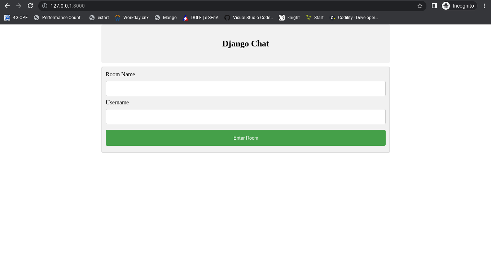
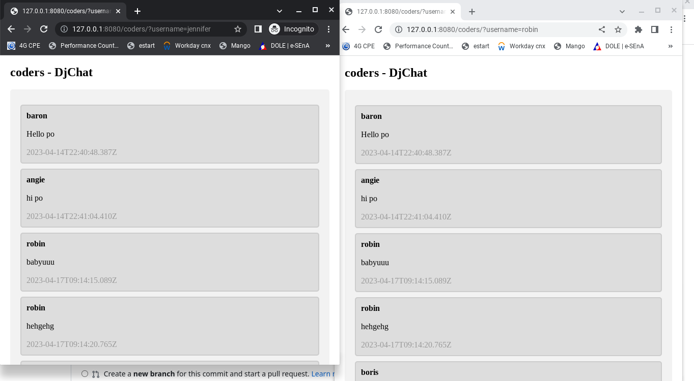

# Rangerchat: A Real Time Chatroom for you and your friends
A chatting application that has a realtime loading of data with Ajax and Django Framework.

# Highlights
| Create or Join Room  | Sample Chatroom   |
| -------------------- | ----------------- |
||  |

# Key Features 
* AJAX message system which provides a good user experience.
* The messages are encrypted for your security.
* Responsive front-end.

# Tools And Its Functionality
* Django & Python: It handles the backend and runs a server in Python.
* HTML, CSS & Javascript: They handle the front-end which is integrated into Django as templates.
* jQuery & AJAX: To handle the messaging and notification modules along with all the asynchronous requests for example in the search bar.

# How to use?
* Install pip from this <a href="https://pip.pypa.io/en/stable/installation/" target="_blank">link</a>
* Install virtualenv from this <a href="https://virtualenv.pypa.io/en/latest/installation.html" target="_blank">link</a>
* Create a virtualenv and activate it. Refer here
* Create a directory called chat_app and save all the folders and files in it
* Change the directory to chat_app
* pip install -r requirements.txt
* Create a superuser using: python manage.py createsuperuser
* Enter the superuser details in DATABASES which is located in settings.py
* python manage.py makemigrations
* python manage.py migrate
* python manage.py runserver and it will automatically choose http://127.0.0.1:8080/ (you can always change port)

# Contribute to my project
* Add new features.
* Create a profile page for users.
* Improve UI/UX.
